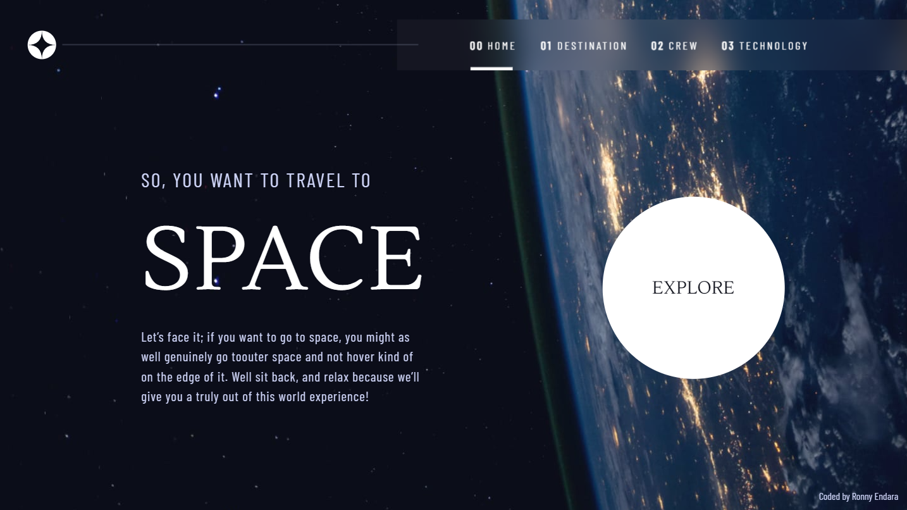
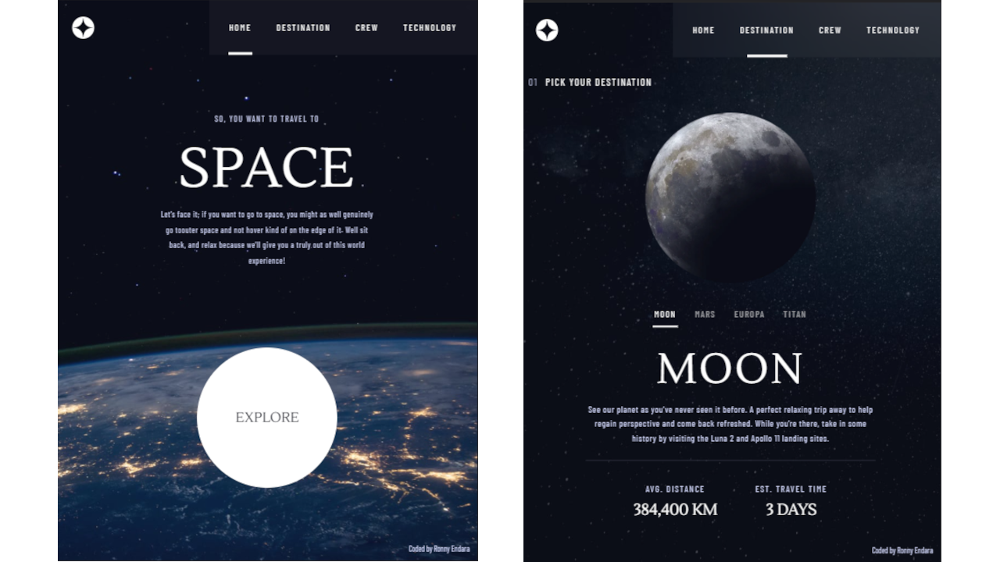
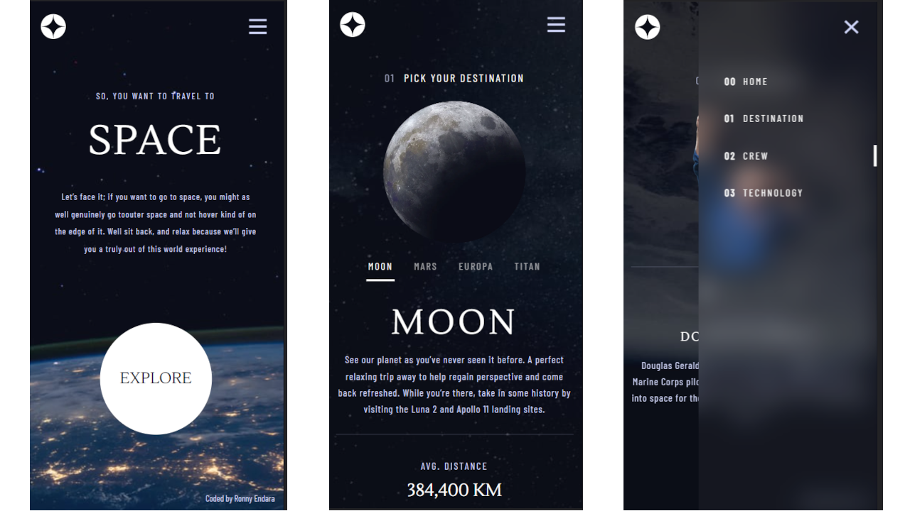

# Frontend Mentor - Space tourism website solution

This is a solution to the [Space tourism website challenge on Frontend Mentor](https://www.frontendmentor.io/challenges/space-tourism-multipage-website-gRWj1URZ3). Frontend Mentor challenges help you improve your coding skills by building realistic projects. 

## Table of contents

- [Overview](#overview)
  - [The challenge](#the-challenge)
  - [Screenshots](#screenshot)
  - [Links](#links)
- [My process](#my-process)
  - [Built with](#built-with)
  - [Install and test](#install-and-test)
- [Author](#author)

## Overview

### The challenge

Users should be able to:

- View the optimal layout for each of the website's pages depending on their device's screen size
- See hover states for all interactive elements on the page
- View each page and be able to toggle between the tabs to see new information

### Screenshots

Desktop
  

Tablet
  

Mobile
  

### Links

- Live Site URL: [Click to live site](https://rojaence.github.io/space-tourism-website/public/)

## My process

### Built with

- Semantic HTML5 markup
- CSS custom properties
- Flexbox
- CSS Grid
- Mobile-first workflow
- SASS
- BEM
- [PUG](https://pugjs.org/api/getting-started.html) - Template Engine
- [GULP](https://gulpjs.com/) - JS Toolkit
- Nodejs

### Install and test

With nodejs and npm installed in your system,
runs the next commands in a terminal

  - To install project - 'npm install'
  - To run serve and compile tasks - 'gulp'

## Author

- Frontend Mentor - [@rojaence](https://www.frontendmentor.io/profile/rojaence)
- LinkedIn - [Ronny Endara](https://www.linkedin.com/in/ronny-endara)

